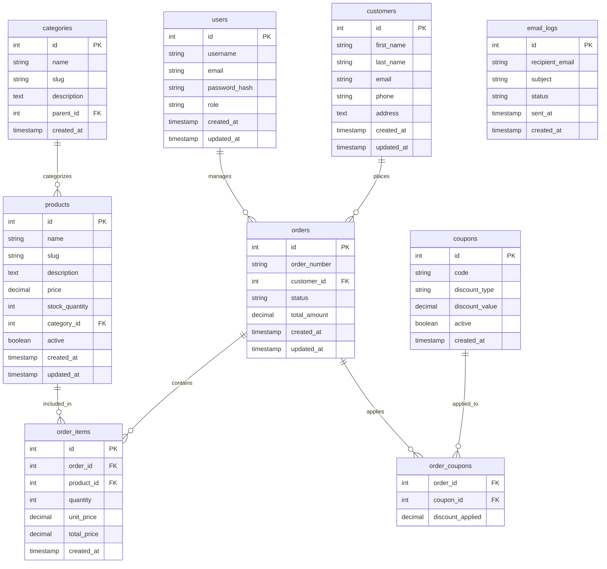

# WooCommerce-like E-commerce SaaS Platform Architecture Plan

## Project Overview
A scalable, maintainable e-commerce platform built with Node.js, Express, EJS, and MySQL, designed as a single-store architecture that can be extended to multi-tenant later.

## 1. Project Directory Structure

```
basicStore/
├── .env                    # Environment variables
├── .env.example           # Example environment variables
├── .gitignore             # Git ignore file
├── package.json           # Dependencies and scripts
├── package-lock.json      # Lock file
├── README.md              # Project documentation
│
├── src/                   # Source code
│   ├── app.js            # Main Express application
│   ├── server.js         # Server entry point
│   │
│   ├── config/           # Configuration files
│   │   ├── database.js   # MySQL connection pool
│   │   ├── email.js      # Nodemailer configuration
│   │   └── session.js    # Session configuration
│   │
│   ├── controllers/      # Business logic controllers
│   │   ├── authController.js
│   │   ├── productController.js
│   │   ├── orderController.js
│   │   ├── customerController.js
│   │   ├── couponController.js
│   │   └── adminController.js
│   │
│   ├── models/           # Database models
│   │   ├── User.js
│   │   ├── Product.js
│   │   ├── Order.js
│   │   ├── OrderItem.js
│   │   ├── Customer.js
│   │   ├── Category.js
│   │   ├── Coupon.js
│   │   └── db.js         # Database initialization
│   │
│   ├── routes/           # Express routes
│   │   ├── index.js      # Main router
│   │   ├── authRoutes.js
│   │   ├── productRoutes.js
│   │   ├── orderRoutes.js
│   │   ├── customerRoutes.js
│   │   ├── adminRoutes.js
│   │   └── api/          # API routes (if needed)
│   │
│   ├── middleware/       # Custom middleware
│   │   ├── auth.js       # Authentication middleware
│   │   ├── validation.js # Input validation
│   │   └── errorHandler.js
│   │
│   ├── utils/            # Utility functions
│   │   ├── emailService.js
│   │   ├── validators.js
│   │   ├── helpers.js
│   │   └── logger.js
│   │
│   ├── public/           # Static assets
│   │   ├── css/
│   │   ├── js/
│   │   ├── images/
│   │   └── uploads/      # Product images (reserved)
│   │
│   └── views/            # EJS templates
│       ├── layouts/
│       │   └── main.ejs  # Main layout
│       │
│       ├── partials/     # Reusable components
│       │   ├── header.ejs
│       │   ├── footer.ejs
│       │   ├── navbar.ejs
│       │   └── messages.ejs
│       │
│       ├── home/         # Public pages
│       │   ├── index.ejs
│       │   ├── product-list.ejs
│       │   ├── product-detail.ejs
│       │   └── cart.ejs
│       │
│       ├── auth/         # Authentication pages
│       │   ├── login.ejs
│       │   ├── register.ejs
│       │   └── forgot-password.ejs
│       │
│       └── admin/        # Admin dashboard
│           ├── dashboard.ejs
│           ├── products/
│           │   ├── list.ejs
│           │   ├── create.ejs
│           │   ├── edit.ejs
│           │   └── categories.ejs
│           ├── orders/
│           │   ├── list.ejs
│           │   ├── detail.ejs
│           │   └── status.ejs
│           ├── customers/
│           │   ├── list.ejs
│           │   └── detail.ejs
│           ├── coupons/
│           │   ├── list.ejs
│           │   ├── create.ejs
│           │   └── edit.ejs
│           └── reports/
│               ├── sales.ejs
│               └── inventory.ejs
│
├── database/             # Database scripts
│   ├── schema.sql       # Complete database schema
│   ├── seeds.sql        # Sample data
│   └── migrations/      # Database migrations (future)
│
├── tests/               # Test files
│   ├── unit/
│   └── integration/
│
└── docs/                # Documentation
    ├── api.md
    └── deployment.md
```

## 2. MySQL Database Schema Design

### Core Tables

```sql
-- Users table (for admin authentication)
CREATE TABLE users (
    id INT PRIMARY KEY AUTO_INCREMENT,
    username VARCHAR(50) UNIQUE NOT NULL,
    email VARCHAR(100) UNIQUE NOT NULL,
    password_hash VARCHAR(255) NOT NULL,
    role ENUM('admin', 'manager', 'staff') DEFAULT 'staff',
    created_at TIMESTAMP DEFAULT CURRENT_TIMESTAMP,
    updated_at TIMESTAMP DEFAULT CURRENT_TIMESTAMP ON UPDATE CURRENT_TIMESTAMP
);

-- Customers table
CREATE TABLE customers (
    id INT PRIMARY KEY AUTO_INCREMENT,
    first_name VARCHAR(50) NOT NULL,
    last_name VARCHAR(50) NOT NULL,
    email VARCHAR(100) UNIQUE NOT NULL,
    phone VARCHAR(20),
    address TEXT,
    city VARCHAR(50),
    state VARCHAR(50),
    zip_code VARCHAR(20),
    country VARCHAR(50) DEFAULT 'USA',
    created_at TIMESTAMP DEFAULT CURRENT_TIMESTAMP,
    updated_at TIMESTAMP DEFAULT CURRENT_TIMESTAMP ON UPDATE CURRENT_TIMESTAMP
);

-- Categories table
CREATE TABLE categories (
    id INT PRIMARY KEY AUTO_INCREMENT,
    name VARCHAR(100) NOT NULL,
    slug VARCHAR(100) UNIQUE NOT NULL,
    description TEXT,
    parent_id INT NULL,
    created_at TIMESTAMP DEFAULT CURRENT_TIMESTAMP,
    FOREIGN KEY (parent_id) REFERENCES categories(id) ON DELETE SET NULL
);

-- Products table
CREATE TABLE products (
    id INT PRIMARY KEY AUTO_INCREMENT,
    name VARCHAR(200) NOT NULL,
    slug VARCHAR(200) UNIQUE NOT NULL,
    description TEXT,
    short_description TEXT,
    sku VARCHAR(50) UNIQUE,
    price DECIMAL(10, 2) NOT NULL,
    sale_price DECIMAL(10, 2),
    cost DECIMAL(10, 2),
    stock_quantity INT DEFAULT 0,
    low_stock_threshold INT DEFAULT 5,
    category_id INT,
    featured BOOLEAN DEFAULT FALSE,
    active BOOLEAN DEFAULT TRUE,
    image_url VARCHAR(500),
    created_at TIMESTAMP DEFAULT CURRENT_TIMESTAMP,
    updated_at TIMESTAMP DEFAULT CURRENT_TIMESTAMP ON UPDATE CURRENT_TIMESTAMP,
    FOREIGN KEY (category_id) REFERENCES categories(id) ON DELETE SET NULL
);

-- Orders table
CREATE TABLE orders (
    id INT PRIMARY KEY AUTO_INCREMENT,
    order_number VARCHAR(50) UNIQUE NOT NULL,
    customer_id INT NOT NULL,
    status ENUM('pending', 'processing', 'shipped', 'delivered', 'cancelled', 'refunded') DEFAULT 'pending',
    subtotal DECIMAL(10, 2) NOT NULL,
    tax_amount DECIMAL(10, 2) DEFAULT 0,
    shipping_amount DECIMAL(10, 2) DEFAULT 0,
    total_amount DECIMAL(10, 2) NOT NULL,
    payment_method VARCHAR(50),
    shipping_address TEXT,
    billing_address TEXT,
    notes TEXT,
    created_at TIMESTAMP DEFAULT CURRENT_TIMESTAMP,
    updated_at TIMESTAMP DEFAULT CURRENT_TIMESTAMP ON UPDATE CURRENT_TIMESTAMP,
    FOREIGN KEY (customer_id) REFERENCES customers(id) ON DELETE CASCADE
);

-- Order items table
CREATE TABLE order_items (
    id INT PRIMARY KEY AUTO_INCREMENT,
    order_id INT NOT NULL,
    product_id INT NOT NULL,
    quantity INT NOT NULL,
    unit_price DECIMAL(10, 2) NOT NULL,
    total_price DECIMAL(10, 2) NOT NULL,
    created_at TIMESTAMP DEFAULT CURRENT_TIMESTAMP,
    FOREIGN KEY (order_id) REFERENCES orders(id) ON DELETE CASCADE,
    FOREIGN KEY (product_id) REFERENCES products(id) ON DELETE RESTRICT
);

-- Coupons table
CREATE TABLE coupons (
    id INT PRIMARY KEY AUTO_INCREMENT,
    code VARCHAR(50) UNIQUE NOT NULL,
    description TEXT,
    discount_type ENUM('percentage', 'fixed') DEFAULT 'percentage',
    discount_value DECIMAL(10, 2) NOT NULL,
    minimum_order DECIMAL(10, 2),
    maximum_discount DECIMAL(10, 2),
    usage_limit INT,
    used_count INT DEFAULT 0,
    valid_from DATE,
    valid_until DATE,
    active BOOLEAN DEFAULT TRUE,
    created_at TIMESTAMP DEFAULT CURRENT_TIMESTAMP
);

-- Order coupons junction table
CREATE TABLE order_coupons (
    order_id INT NOT NULL,
    coupon_id INT NOT NULL,
    discount_applied DECIMAL(10, 2) NOT NULL,
    PRIMARY KEY (order_id, coupon_id),
    FOREIGN KEY (order_id) REFERENCES orders(id) ON DELETE CASCADE,
    FOREIGN KEY (coupon_id) REFERENCES coupons(id) ON DELETE RESTRICT
);

-- Email notifications log
CREATE TABLE email_logs (
    id INT PRIMARY KEY AUTO_INCREMENT,
    recipient_email VARCHAR(100) NOT NULL,
    subject VARCHAR(200) NOT NULL,
    template_name VARCHAR(100),
    status ENUM('sent', 'failed', 'pending') DEFAULT 'pending',
    error_message TEXT,
    sent_at TIMESTAMP NULL,
    created_at TIMESTAMP DEFAULT CURRENT_TIMESTAMP
);
```

### Database Relationships Diagram



## 3. API Routes Structure

### Public Routes (Frontend)
```
GET     /                           -> Homepage
GET     /products                   -> Product listings
GET     /products/:slug             -> Product details
GET     /cart                       -> Shopping cart
POST    /cart/add                   -> Add to cart
POST    /cart/update                -> Update cart
POST    /cart/remove                -> Remove from cart
GET     /checkout                   -> Checkout page
POST    /checkout                   -> Process order
GET     /order-confirmation/:id     -> Order confirmation
```

### Authentication Routes
```
GET     /login                      -> Login page
POST    /login                      -> Login process
GET     /register                   -> Registration page
POST    /register                   -> Registration process
POST    /logout                     -> Logout
GET     /forgot-password            -> Forgot password page
POST    /forgot-password            -> Send reset email
GET     /reset-password/:token      -> Reset password page
POST    /reset-password/:token      -> Update password
```

### Admin Routes (Protected)
```
GET     /admin                      -> Admin dashboard
GET     /admin/products             -> Product list
GET     /admin/products/new         -> Create product form
POST    /admin/products             -> Create product
GET     /admin/products/:id/edit    -> Edit product form
PUT     /admin/products/:id         -> Update product
DELETE  /admin/products/:id         -> Delete product
GET     /admin/categories           -> Category management

GET     /admin/orders               -> Order list
GET     /admin/orders/:id           -> Order details
PUT     /admin/orders/:id/status    -> Update order status
GET     /admin/orders/reports       -> Sales reports

GET     /admin/customers            -> Customer list
GET     /admin/customers/:id        -> Customer details
PUT     /admin/customers/:id        -> Update customer

GET     /admin/coupons              -> Coupon list
GET     /admin/coupons/new          -> Create coupon form
POST    /admin/coupons              -> Create coupon
PUT     /admin/coupons/:id          -> Update coupon
DELETE  /admin/coupons/:id          -> Delete coupon

GET     /admin/settings             -> Store settings
PUT     /admin/settings             -> Update settings
```

### API Routes (RESTful - Optional for future)
```
GET     /api/products               -> List products
GET     /api/products/:id           -> Get product
POST    /api/products               -> Create product
PUT     /api/products/:id           -> Update product
DELETE  /api/products/:id           -> Delete product

GET     /api/orders                 -> List orders
GET     /api/orders/:id             -> Get order
POST    /api/orders                 -> Create order
PUT     /api/orders/:id             -> Update order

GET     /api/customers              -> List customers
GET     /api/customers/:id          -> Get customer
POST    /api/customers              -> Create customer
PUT     /api/customers/:id          -> Update customer
```

## 4. EJS Templates Structure

### Layout System
- `layouts/main.ejs`: Base layout with HTML structure, includes header/footer partials
- `partials/header.ejs`: Navigation bar, site header
- `partials/footer.ejs`: Footer content, scripts
- `partials/navbar.ejs`: Navigation menu (different for admin/public)
- `partials/messages.ejs`: Flash messages display

### Public Templates
- `home/index.ejs`: Homepage with featured products, categories
- `home/product-list.ejs`: Product grid with filters, pagination
- `home/product-detail.ejs`: Single product view with add-to-cart
- `home/cart.ejs`: Shopping cart with quantity updates
- `home/checkout.ejs`: Checkout form with address, payment
- `home/order-confirmation.ejs`: Order success page

### Authentication Templates
- `auth/login.ejs`: Login form with email/password
- `auth/register.ejs`: Registration form
- `auth/forgot-password.ejs`: Password reset request form

### Admin Templates
- `admin/dashboard.ejs`: Overview with stats, recent orders, sales charts
- `admin/products/list.ejs`: Product table with search, filters, bulk actions
- `admin/products/create.ejs`: Product creation form with WYSIWYG editor
- `admin/products/edit.ejs`: Product editing form
- `admin/products/categories.ejs`: Category management tree
- `admin/orders/list.ejs`: Orders table with status filters
- `admin/orders/detail.ejs`: Order details with items, customer info
- `admin/orders/status.ejs`: Order status update interface
- `admin/customers/list.ejs`: Customers table with search
- `admin/customers/detail.ejs`: Customer profile with order history
- `admin/coupons/list.ejs`: Coupons table with validity status
- `admin/coupons/create.ejs`: Coupon creation form
- `admin/coupons/edit.ejs`: Coupon editing form
- `admin/reports/sales.ejs`: Sales reports with date range filters
- `admin/reports/inventory.ejs`: Low stock alerts, inventory reports

## 5. Environment Variables Configuration

### .env.example
```env
# Server Configuration
PORT=3000
NODE_ENV=development
SESSION_SECRET=your_session_secret_key_here

# Database Configuration
DB_HOST=localhost
DB_PORT=3306
DB_NAME=basicStore
DB_USER=root
DB_PASSWORD=

# Email Configuration (for Nodemailer)
EMAIL_HOST=smtp.gmail.com
EMAIL_PORT=587
EMAIL_USER=your_email@gmail.com
EMAIL_PASSWORD=your_app_password
EMAIL_FROM=noreply@basicstore.com
EMAIL_SECURE=false

# Application Settings
APP_NAME=BasicStore
APP_URL=http://localhost:3000
ADMIN_EMAIL=admin@basicstore.com

# Security
BCRYPT_SALT_ROUNDS=10
JWT_SECRET=your_jwt_secret_optional
```

### Environment-specific configurations
- **Development**: Use local MySQL with root/no password
- **Production**: Use environment-specific credentials, secure session secret
- **Testing**: Use test database with separate credentials

## 6. Core Dependencies List for package.json

### Production Dependencies
```json
{
  "dependencies": {
    "express": "^4.18.0",
    "ejs": "^3.1.9",
    "mysql2": "^3.6.0",
    "dotenv": "^16.0.0",
    "bcrypt": "^5.1.0",
    "express-session": "^1.17.3",
    "express-flash": "^0.0.2",
    "express-validator": "^7.0.1",
    "multer": "^1.4.5-lts.1",
    "nodemailer": "^6.9.0",
    "helmet": "^7.0.0",
    "compression": "^1.7.4",
    "morgan": "^1.10.0",
    "cors": "^2.8.5",
    "connect-flash": "^0.1.1",
    "method-override": "^3.0.0"
  }
}
```

### Development Dependencies
```json
{
  "devDependencies": {
    "nodemon": "^3.0.0",
    "jest": "^29.0.0",
    "supertest": "^6.3.0",
    "eslint": "^8.0.0",
    "prettier": "^3.0.0"
  }
}
```

### Scripts Configuration
```json
{
  "scripts": {
    "start": "node src/server.js",
    "dev": "nodemon src/server.js",
    "test": "jest",
    "test:watch": "jest --watch",
    "lint": "eslint src/",
    "lint:fix": "eslint src/ --fix",
    "format": "prettier --write src/",
    "db:init": "node database/init.js",
    "db:seed": "node database/seed.js"
  }
}
```

## 7. Implementation Roadmap

### Phase 1: Foundation Setup (Week 1)
1. **Project Initialization**
   - Update package.json with core dependencies
   - Create .gitignore with Node.js, environment files
   - Set up basic Express server structure
   - Configure environment variables (.env)

2. **Database Setup**
   - Install and configure MySQL connection
   - Create database schema (schema.sql)
   - Implement connection pooling
   - Create basic models with CRUD operations

3. **Authentication System**
   - User model with bcrypt password hashing
   - Session-based authentication middleware
   - Login/register routes and controllers
   - Admin role-based access control

### Phase 2: Core E-commerce Features (Week 2-3)
1. **Product Management**
   - Product model with categories
   - Product CRUD operations
   - Product listing with pagination
   - Product search and filtering

2. **Shopping Cart**
   - Session-based cart functionality
   - Add/remove/update cart items
   - Cart calculation (subtotal, tax, shipping)
   - Cart persistence across sessions

3. **Order Processing**
   - Order model with status tracking
   - Checkout process
   - Order confirmation email
   - Order history for customers

### Phase 3: Admin Dashboard (Week 4)
1. **Admin Interface**
   - Admin layout and navigation
   - Dashboard with statistics
   - Product management interface
   - Order management interface

2. **Customer Management**
   - Customer list and details
   - Customer order history
   - Customer communication tools

3. **Reporting**
   - Sales reports by date range
   - Inventory reports
   - Customer analytics

### Phase 4: Advanced Features (Week 5)
1. **Email Notifications**
   - Nodemailer configuration
   - Order status emails
   - Shipping notifications
   - Promotional emails

2. **Coupon System**
   - Coupon creation and management
   - Discount calculation
   - Usage tracking and limits

3. **Inventory Management**
   - Stock level tracking
   - Low stock alerts
   - Inventory reports

### Phase 5: Polish & Deployment (Week 6)
1. **UI/UX Improvements**
   - Responsive design
   - Form validation
   - Error handling
   - Loading states

2. **Performance Optimization**
   - Database query optimization
   - Caching strategies
   - Image optimization (reserved)

3. **Security Hardening**
   - Input sanitization
   - XSS protection
   - SQL injection prevention
   - Rate limiting

4. **Deployment Preparation**
   - Production environment configuration
   - Database migration scripts
   - Deployment documentation

## 8. Scalability Considerations

### Database Scalability
1. **Index Optimization**: Add indexes on frequently queried columns (slug, email, order_number)
2. **Query Optimization**: Use EXPLAIN to analyze slow queries
3. **Connection Pooling**: Configure appropriate pool size
4. **Read Replicas**: For future high-traffic scenarios

### Application Scalability
1. **Stateless Design**: Store session data in Redis (future)
2. **Horizontal Scaling**: Use load balancer with multiple app instances
3. **Caching Layer**: Implement Redis for product listings, categories
4. **CDN Integration**: For static assets and product images

### Multi-tenant Extension Path
1. **Database Approach**: Add `tenant_id` to all tables
2. **Schema Approach**: Separate schema per tenant
3. **Database-per-tenant**: Isolated databases for security
4. **Middleware**: Tenant identification via subdomain or header

## 9. Security Considerations

### Authentication & Authorization
- Password hashing with bcrypt (salt rounds: 10)
- Session management with secure cookies
- Role-based access control (RBAC)
- Password reset with secure tokens

### Data Protection
- SQL injection prevention with parameterized queries
- XSS protection with output encoding
- CSRF protection tokens
- Input validation with express-validator

### Application Security
- Helmet.js for security headers
- Rate limiting for API endpoints
- File upload validation and restrictions
- Environment variable protection

## 10. Monitoring & Maintenance

### Logging Strategy
- Request logging with morgan
- Error logging to files
- Email notification for critical errors
- Database query logging in development

### Backup Strategy
- Daily database backups
- Product image backups (when implemented)
- Configuration file versioning
- Disaster recovery plan

### Performance Monitoring
- Response time tracking
- Database connection monitoring
- Memory usage monitoring
- Uptime monitoring

## Conclusion

This architecture provides a solid foundation for a WooCommerce-like e-commerce platform that is:
- **Scalable**: Designed for future growth with clear extension paths
- **Maintainable**: Organized code structure with separation of concerns
- **Secure**: Built-in security best practices
- **Extensible**: Ready for payment and shipping integrations

The single-store architecture can be extended to multi-tenant SaaS by adding tenant context to models and middleware, while the modular design allows for easy addition of new features like payment gateways, shipping providers, and advanced analytics.

### Next Steps
1. Review and approve this architecture plan
2. Switch to Code mode to begin implementation
3. Start with Phase 1: Foundation Setup
4. Iterate through the roadmap phases

---
*Last Updated: 2026-03-17*
*Architect: Roo*